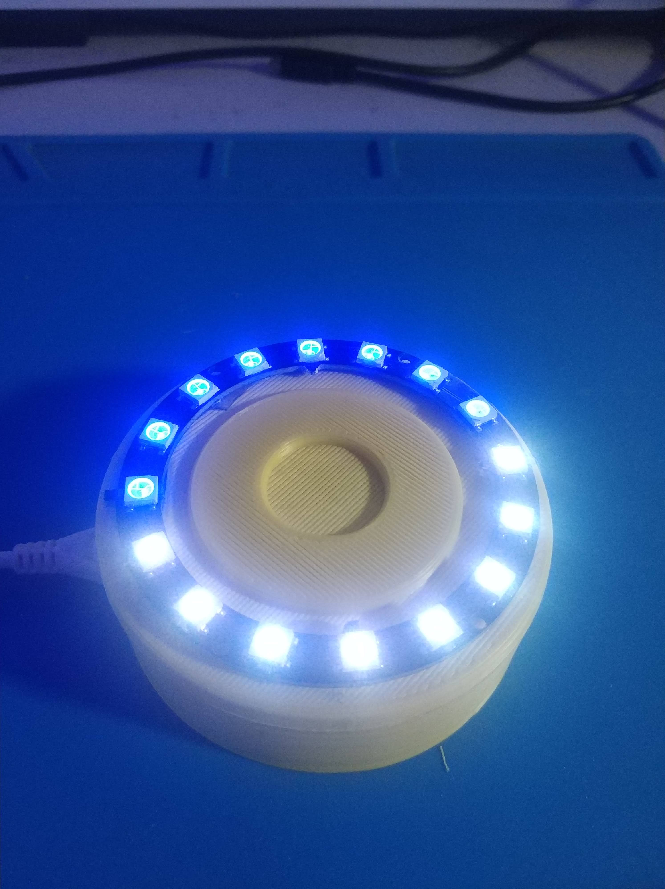
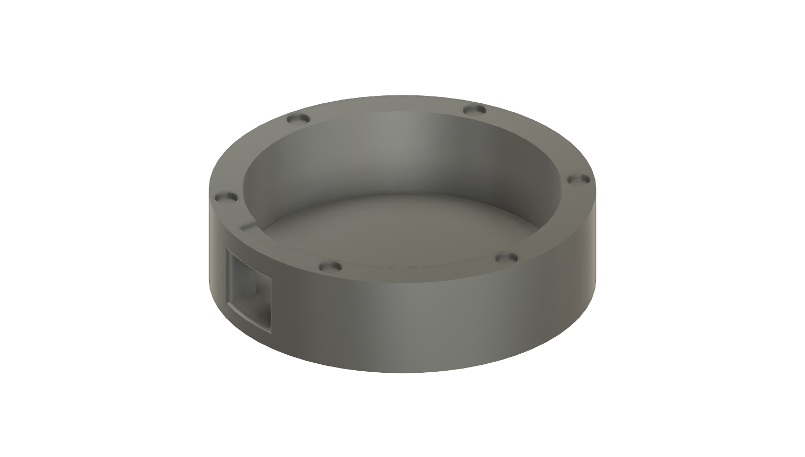

# Timer Pomodoro com ESP8266

Salve meu povo, valeu da presença aqui, vou contar agora um pouco da história por tras desse projeto.
Desde que vi um vídeo do pessoal da Locaweb falando sobre a técnica de pomodoro venho usando ela, sempre achei de grande valia as repetições e os intervalos e como Maker, sempre tem uns componentes esperando por projetos na bancada né! Então porque não unir forças ?

Tinha em mãos um Led Ring daqueles Neopixels de 16 Leds RGBs (ws2812b), usava em algum projetinho temporário e depois deixava eles sozinhos em alguma caixa a espera de um próximo projeto, eis que fazendo uma live na twitch - o que!? não conhece meu canal lá? vai lá, da um follow, escorrega um prime e manda uns subs de presente pra galera :P [kaduzius](http://twitch.tv) - resolvi que era hora de dar uma função nobre pro "Reator ARC" que tinha parado aqui.

O projeto está na sua versão 1.0 e é bem básico, conta os Pomodoros e seus intervalos, 25 minutos de foco, 5 minutos de descanço e depois de 4 repetições um descanço maior de 15 minutos.

Nesse projeto fiz algumas coisas bacanas para aprimorar conceitos como Orientação a Objetos e Maquina de Estados, o que tornou o código bem legal de escrever, gostei muito da experiência, valeu [@id_akira](http://twitch.tv/id_akira) e [@dornellestv](http://twitch.tv/dornellestv) pelo help, valeu pessoal da live que também ajudou, #OrgulhoDeSerDoChat!

## Materiais
- Led Ring com 16 Leds [link](https://s.click.aliexpress.com/e/_A5doku)
- Wemos D1 [link](https://s.click.aliexpress.com/e/_A2Wcpw)
- Plaquinha de Shield de Wemos do Kadu ;) [link](https://oshwlab.com/nicodemosbr/gatekeeperiot)
- Touch Button TTP223B [link](https://s.click.aliexpress.com/e/_Atkhcy)
- Buzzer
- Fios

# Funcionamento
O pomodoro timer se utiliza de um botão (touch) central, onde é possivel dar Play/Pause e Skip nos estados do relógio.

Um toque altera entre Play e Pause, já um toque longo irá fazer um skip para o próximo ciclo.

Os Status são dados por diferentes colorações nos Leds. Quando o led está esperando por alguma ação do usuário, ele apresentará 2 cores e elas representam qual será o próximo ciclo.

### Cores (na espera)

**Amarelo - Vermelho** - Próximo Status será Pomodoro (25 minutos)

**Azul - Branco** - Próximo Status será Intervalo curto (5 minutos)

**Roxo - Rosa** - Próximo Status será Intervalo longo (15 minutos)

### Cores (Contando tempo)
**Vermelho** - Pomororo (25 minutos)

**Azul** - Intervalo (5 minutos)

**Roxo** - Intervalo longo (15 minutos)

As luzes começam todas acesas e vão se apagando ao decorrer do tempo, faltando 1 minuto, todos os Leds são ascesos novamente e depois do decorrer desse tempo, um Bip avisa sobre o encerramento daquele intervalo.

## Código
Um pouco mais sobre o código.

Estamos usando um ESP8266, com suporte a OTA (Atualização Remota), algumas bibliotecas para ajudar com os botões e os sons.

## Imagens

Vídeo

# Arquivos 3D

Você poderá encontrar na pasta 3D Files os arquivos, STLs, STEP e o f3d da criação do case.
A conexão das partes forão feitas utilizando Imãs de neodimeo de 4mmx2mm, ficou bem firme!

## Próximos passos

Uma das idéias surgidas é que seja possivel fazer uma conexão com outros relógios pomodoros, permitindo assim avisar pessoas em comodos diferentes qual é seu "estado" atual, evitando assim possíveis interrupções. 

O mano [@em1dio](http://twitch.tv/em1dio) também comentou que seria bacana ter uma integração com a twitch, permitindo que streamers que utilizam Pomodoro possam sincronizar algum overlay com o status do seu Pomodoro Timer.

Projeto sempre aberto a colaboração!

VqV e Valeu!